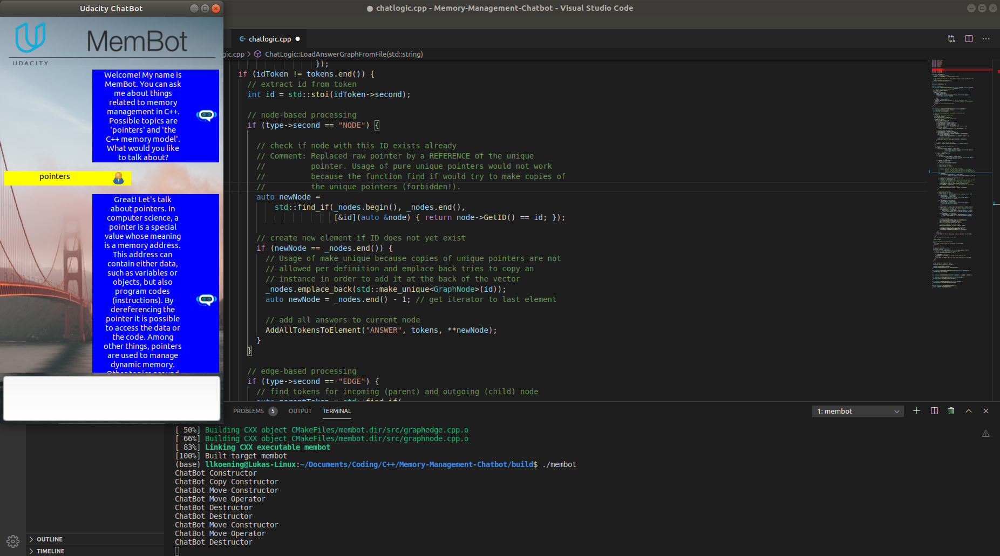
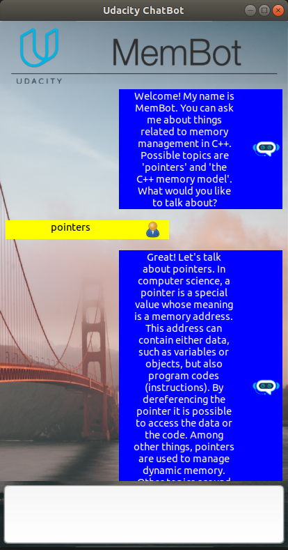

# Project 3 - Memory Management Bot

This is the third project from [Udacity's C++ Nanodegree Program](https://www.udacity.com/course/c-plus-plus-nanodegree--nd213). It covers memory management, memory optimized coding and smart-pointers in the coding language C++.

----

## Project Overview

### Goals:

* Improve the given chat bot from Udacity to use modern memory management (smart-pointers etc.)
* Prevent all errors especially by memory leaks or related mistakes.

### Structure:

The project is divided into different files. All header files can be found in the `include` folder.

* `src/chatgui.cpp` (and header file): Graphical user interface for the chat bot
* `src/chatbot.cpp` (and header file): Object for the chat bot including all functions for the Rule Of Five
* `src/chatlogic.cpp` (and header file): Logic for the chat bot
* `src/chatnode.cpp` (and header file): Node object for the state machine
* `src/chatedge.cpp` (and header file): Edge object for the state machine
* other helper, build and installation files

### Dependencies

This project needs following dependencies:

* cmake >= 3.11
* make >= 4.1 (Linux, Mac) or >= 3.81 (Windows)
* gcc/g++ >= 5.4
* wxWidgets >= 3.0
  * Installation instructions can be found [here](https://wiki.wxwidgets.org/Install).

### Basic Build and Run Instructions

1. Clone this repository.
2. Install dependencies.
3. Make a build directory in the top level directory: `mkdir build && cd build`
4. Compile: `cmake .. && make`
5. Run it: `./membot`.

----

# Results

Here you can see an example result:

